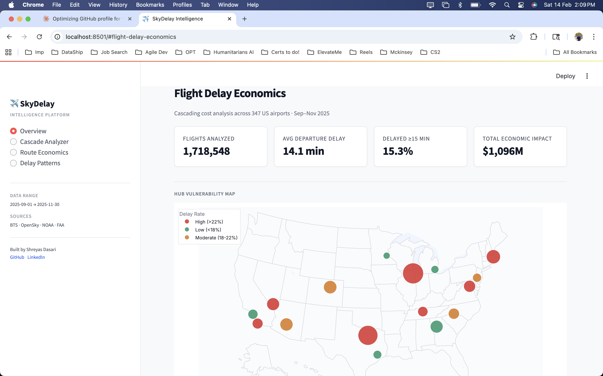
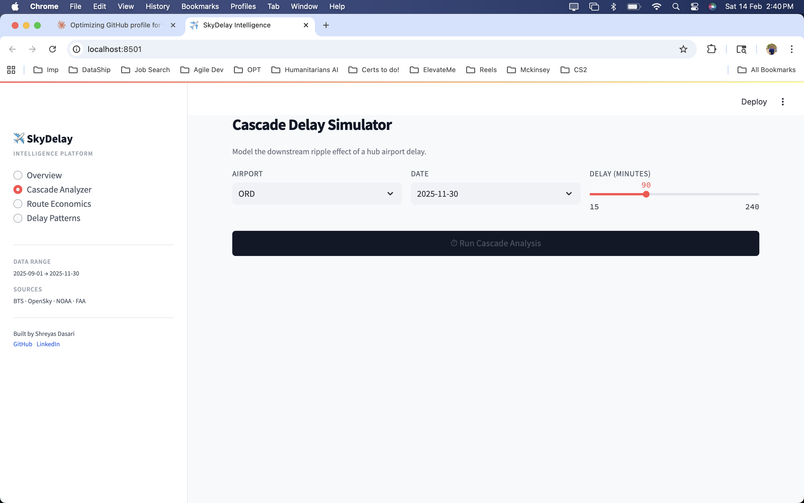
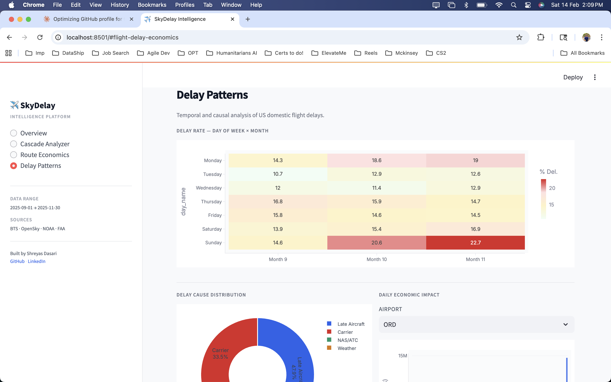

# ✈️ SkyDelay Intelligence

**Airlines lose $28 billion annually to cascading flight delays.** This platform quantifies that cost by fusing 4 real-time aviation data sources, modeling delay cascade propagation across hub airports, and exposing the results via an MCP server for AI agent consumption — with a self-healing pipeline that monitors and repairs itself autonomously.

> A single 90-minute delay at Chicago O'Hare cascades to **1,565 downstream flights**, affecting **296,774 passengers** with a total economic impact of **$32.9 million**.

**[Live Dashboard](https://skydelay.streamlit.app)** · **[MCP Server Docs](#mcp-server)** · **[Architecture](#architecture)**

---

## Dashboard








---

## Architecture

```
┌─────────────────────────────────────────────────────────────────┐
│                        DATA SOURCES                             │
├──────────────┬──────────────┬───────────────┬───────────────────┤
│  BTS On-Time │  OpenSky     │  NOAA Aviation│  FAA NAS Status   │
│  Performance │  Network     │  Weather      │                   │
│  (1.7M rows) │  (Live ADS-B)│  (METARs)     │  (Ground Delays)  │
└──────┬───────┴──────┬───────┴───────┬───────┴─────────┬─────────┘
       │              │               │                 │
       ▼              ▼               ▼                 ▼
┌─────────────────────────────────────────────────────────────────┐
│                     INGESTION LAYER                             │
│  bts_historical_loader.py  │  opensky_producer.py               │
│  noaa_weather_producer.py  │  faa_asws_producer.py              │
└──────────────────────────────┬──────────────────────────────────┘
                               │
                               ▼
┌─────────────────────────────────────────────────────────────────┐
│                     DuckDB  (Local OLAP)                        │
│  raw_bts_flights  │  raw_opensky_positions                      │
│  raw_weather_observations  │  raw_faa_airport_status            │
└──────────────────────────────┬──────────────────────────────────┘
                               │
                               ▼
┌─────────────────────────────────────────────────────────────────┐
│               TRANSFORMATION LAYER (dbt models)                 │
│                                                                 │
│  Staging:  stg_bts_flights │ stg_opensky │ stg_weather │ stg_faa│
│  Intermediate:  int_airport_daily_metrics │ int_route_performance│
│  Marts:  mart_delay_economics │ mart_cascade_vulnerability      │
│          mart_route_economics                                   │
└──────────────────────────────┬──────────────────────────────────┘
                               │
                    ┌──────────┼──────────┐
                    ▼          ▼          ▼
             ┌───────────┐ ┌────────┐ ┌──────────────────┐
             │ Streamlit │ │  MCP   │ │ LangGraph Agent  │
             │ Dashboard │ │ Server │ │ (Self-Healing)   │
             │ (4 pages) │ │(6 tools│ │ Monitors→Detects │
             │           │ │  for   │ │ →Diagnoses→Fixes │
             │           │ │  AI    │ │ →Reports         │
             │           │ │ agents)│ │                  │
             └───────────┘ └────────┘ └──────────────────┘
```

---

## What Makes This Project Unique

Most flight delay projects on GitHub download a Kaggle CSV and train a classifier. This project is different:

**1. Cascade Economics (nobody else has built this)**
When a hub airport delays, connecting flights downstream are also affected. The cascade calculator models this ripple effect — tracing which flights, passengers, and dollars are impacted — using FAA/NEXTOR cost methodology.

**2. Four Live Data Sources (not a static dataset)**
Real-time aircraft positions from ADS-B transponders (OpenSky), current airport weather conditions (NOAA METARs), FAA ground delay programs, and 1.7M historical flight records (BTS). All ingested, cleaned, and transformed.

**3. MCP Server (2026 agentic architecture)**
The platform exposes 6 tools via Model Context Protocol, allowing any AI agent (Claude, GPT, Cursor) to query aviation disruptions. This is the standard for AI-data connectivity in 2026.

**4. Self-Healing Pipeline (LangGraph + Gemini)**
An autonomous agent monitors all data sources, detects staleness or failures, diagnoses root causes using Gemini, auto-remediates by re-running ingestion, verifies the fix, and generates a health report — without human intervention.

---

## Key Findings

| Metric | Value |
|---|---|
| Flights analyzed | 1,718,548 |
| Most cascade-vulnerable airport | ORD (score: 45.0) |
| Costliest airport (3 months) | ORD — $89.9M |
| Costliest route | ORD→EWR (UA) — $1.84M |
| Dominant delay cause | Late Aircraft (47.9%) |
| Worst day for delays | Sunday in November (22.7%) |

---

## Tech Stack

| Layer | Technologies |
|---|---|
| **Ingestion** | Python, requests, OpenSky REST API, NOAA Aviation Weather API, FAA NAS Status API, BTS TranStats |
| **Storage** | DuckDB (local OLAP) |
| **Transformation** | dbt-style SQL models (staging → intermediate → mart), custom Python runner |
| **Analysis** | Cascade propagation model, FAA/NEXTOR economic impact methodology |
| **Dashboard** | Streamlit, Plotly (scatter_geo, heatmaps, bar/line/pie charts) |
| **AI/Agentic** | FastMCP (Model Context Protocol), LangGraph, Google Gemini |
| **SQL** | 7 portfolio queries — window functions, CTEs, self-joins, cohort analysis |

---

## Quick Start

### Prerequisites
- Python 3.10+
- 2GB free disk space (for BTS data)

### Setup

```bash
git clone https://github.com/ShreyasDasari/SkyDelay-Intelligence.git
cd SkyDelay-Intelligence
pip install -r requirements.txt
```

### Load Data

```bash
# 1. Download BTS on-time data from https://www.transtats.bts.gov
#    Select "Prezipped File" for 3 months → save CSVs in data/bts/
mkdir -p data/bts

# 2. Load historical data
python -m src.ingestion.bts_historical_loader --csv-dir data/bts/

# 3. Ingest live sources
python -m src.ingestion.opensky_producer --once
python -m src.ingestion.noaa_weather_producer --once
python -m src.ingestion.faa_asws_producer --once

# 4. Build transformation pipeline
cd src/dbt_project && python run_models.py && cd ../..
```

### Run Dashboard

```bash
streamlit run src/dashboard/app.py
```

### Run Cascade Analysis

```bash
python -m src.processing.cascade_calculator
```

### Run Self-Healing Agent

```bash
export GOOGLE_API_KEY="your-gemini-api-key"
python -m src.agents.pipeline_health_agent
```

### Start MCP Server

```bash
python -m src.mcp_server.server
```

### Run Autonomous Scheduler

```bash
python -m src.scheduler
```

---

## MCP Server

The MCP server exposes 6 tools that any AI agent can use:

| Tool | Description |
|---|---|
| `get_airport_delay_summary` | Delay metrics, cause breakdown, and economic impact for any airport |
| `simulate_cascade_impact` | Model cascading delay effects at a hub airport |
| `get_hub_vulnerability_ranking` | Ranked list of airports by cascade vulnerability |
| `get_costliest_routes` | Routes with highest delay-driven economic losses |
| `get_airport_weather` | Current METAR weather conditions at an airport |
| `get_pipeline_health` | Health status of all data sources and tables |

**Configure in Claude Desktop** (`claude_desktop_config.json`):
```json
{
    "mcpServers": {
        "skydelay": {
            "command": "python",
            "args": ["-m", "src.mcp_server.server"],
            "cwd": "/path/to/SkyDelay-Intelligence"
        }
    }
}
```

---

## Self-Healing Pipeline

The LangGraph agent follows a 5-node state machine:

```
Check Health → Detect Issues → Diagnose (Gemini) → Auto-Remediate → Re-Check
                    │                                       │
                    └── No issues ──→ Generate Report ◄─────┘
```

Example output:
```
Overall Status: 🟢 HEALTHY
Sources: 7/7 healthy | 0 warnings | 0 stale | 0 critical

  ✅ raw_bts_flights                1,738,833 rows  [healthy]
  ✅ raw_opensky_positions              1,860 rows  [healthy]
  ✅ raw_weather_observations              33 rows  [healthy]
  ✅ raw_faa_airport_status                 2 rows  [healthy]
  ✅ mart_delay_economics              30,364 rows  [healthy]

Actions Taken:
  ✅ Re-ingest FAA status: success
```

---

## SQL Portfolio

Seven analytical queries demonstrating window functions, CTEs, self-joins, conditional aggregation, and business modeling:

1. **Hub Cascade Vulnerability Ranking** — Composite scoring with RANK, NTILE
2. **Rolling 7-Day Delay Trend** — LAG, window AVG, week-over-week change
3. **Delay Cause by Hour of Day** — CASE pivoting, proportional analysis
4. **Airline Performance Scorecard** — PERCENT_RANK, peer benchmarking
5. **Day × Month Heatmap** — Cross-tab aggregation
6. **Route Economic Impact** — Multi-step cost estimation in SQL
7. **Cascade Chain Detection** — Self-join, recursive delay propagation

---

## Database Schema

13 tables across 4 layers:

```
[RAW]            raw_bts_flights              1,738,833 rows
[RAW]            raw_opensky_positions            1,860 rows
[RAW]            raw_weather_observations            33 rows
[RAW]            raw_faa_airport_status                2 rows
[STAGING]        stg_bts_flights              1,738,833 rows
[STAGING]        stg_opensky_positions            1,860 rows
[STAGING]        stg_weather_observations            33 rows
[STAGING]        stg_faa_delays                        2 rows
[INTERMEDIATE]   int_airport_daily_metrics       30,364 rows
[INTERMEDIATE]   int_route_performance            8,436 rows
[MART]           mart_delay_economics            30,364 rows
[MART]           mart_cascade_vulnerability          161 rows
[MART]           mart_route_economics              8,436 rows
```

---

## Who Benefits

| Stakeholder | Use Case |
|---|---|
| **Airline Operations** | Real-time cascade impact during ground delay programs |
| **Airport Authorities** | Vulnerability analysis for infrastructure investment decisions |
| **Travel Insurance** | AI-powered claims validation via MCP server |
| **Travel Tech** | Delay prediction and proactive traveler alerts |
| **Data Teams** | Self-healing pipeline pattern for any data platform |

---

## Methodology

Economic impact estimates use the **FAA/NEXTOR II Total Delay Impact Study** (inflation-adjusted to 2025):

- Passenger delay cost: **$0.74 per minute per passenger**
- Airline operations cost: **$68.48 per minute per delayed flight**
- Average load factor: **87%**
- Average seats per domestic flight: **160**

Cascade propagation is modeled by matching same-airline inbound delays with outbound departures within a turnaround window, identifying flights where the inbound delay exceeds the available turnaround buffer.

---

## License

MIT

---

## Author

**Shreyas Dasari** — Northeastern University

[GitHub](https://github.com/ShreyasDasari) · [LinkedIn](https://linkedin.com/in/shreyasdasari)